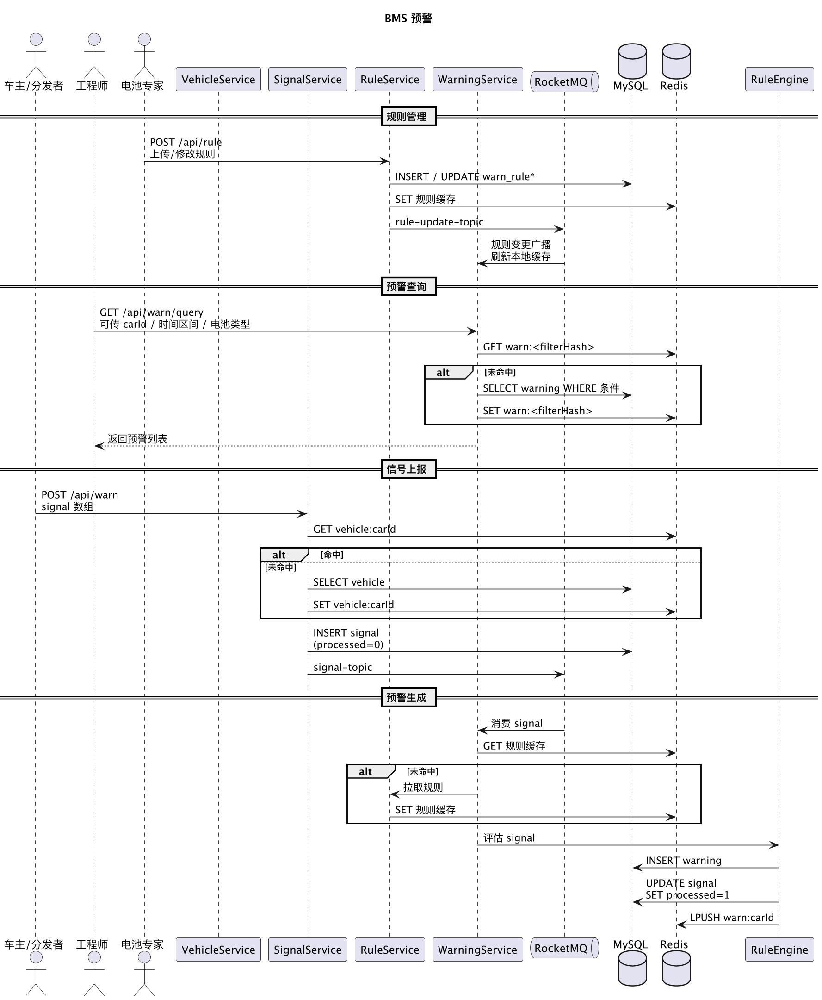
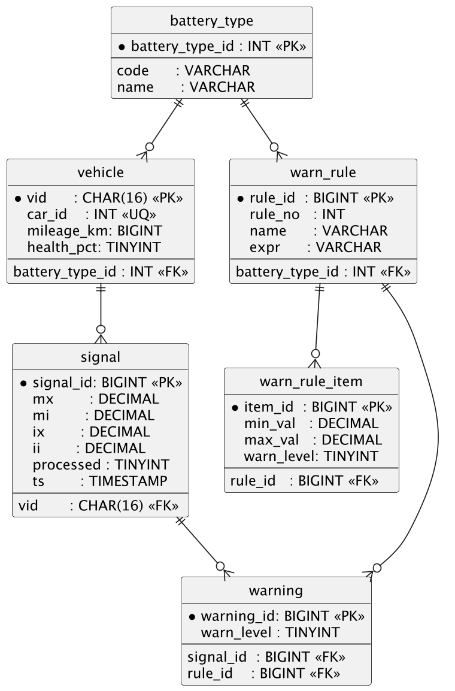

# 架构设计

> 首先考虑的是解决软件系统复杂度带来的问题，其次考虑高性能、高可用、可扩展。

## 问题拆分

从需求文档的篇幅来看，**最重要需要实现的是电池预警接口**，即`/api/warn`；所谓的信号上报对应了一个HTTP POST接口，输入（请求）/输出（响应）在需求文档有所举例。 

```json
[
  {
    "carId": 1,
    "warnId": 1,
    "signal": "{\"Mx\":12.0,\"Mi\":0.6}"
  },
  {
    "carId": 2,
    "warnId": 2,
    "signal": "{\"Ix\":12.0,\"Ii\":11.7}"
  },
   {
    "carId": 3,
    "signal": "{\"Mx\":11.0,\"Mi\":9.6,\"Ix\":12.0,\"Ii\":11.7}"
  }
]
```

和

```json
{
    "status": 200,
    "msg": "ok",
    "data": 
        [
            {
                "车架编号": 1,
                "电池类型": "三元电池",
                "warnName": "电压差报警",
                "warnLevel": 0
            },
            {
                "车架编号": 2,
                "电池类型": "铁锂电池",
                "warnName": "电流差报警",
                "warnLevel": 2
            },
            {
                "车架编号": 3,
                "电池类型": "三元电池",
                "warnName": "电压差报警",
                "warnLevel": 2
            },
            {
                "车架编号": 3,
                "电池类型": "三元电池",
                "warnName": "电流差报警",
                "warnLevel": 2
            }
         ]
}
```

**同时**，还需要考虑到对于车辆存储信息的查询（与管理），规则存储信息的查询（管理与解析），以及信号的存储（与解析）。 这意味着，我们可以将整个系统拆分为，若干个服务：
- Vehicle Service（车辆信息）
- Signal Service（电池信号状态上报/查询，保证缓存和数据库数据的一致性）
- Rule Service（规则管理、动态解析） 
- Warning Service（定时任务扫描电池信号数据，预警生成与查询；发送MQ消息，消费MQ消息生成预警信息；支持通过预警接口查询指定车辆的预警信息）

然而，考虑到不过度设计，本项目优先采用单体架构。

### 高性能、高可用、可扩展的考量？
因此我们考虑数据库的分库分表/Redis（集群）的数据缓存。此外，需求文档将**上报接口**和**预警接口**合并作为实例，但这似乎违背了需求文档此前提到的：
1. 定时任务扫描电池信号数据，发送MQ消息，消费MQ消息生成预警信息；
2. 流程图中，汽车信号的上报位于车主的泳道内，而电池信号的预警判断位于工程师相关的泳道内；



暂时不考虑角色权限和 API 网关。

### 系统架构

按照Bounded Context服务拆分和DDD，设计：

- 接入层：HTTP接口、流量治理
- 应用层：处理核心业务
- 领域层：数据模型与数据操作
- 基础设施：MySQL/Redis/MQ第三方中间件

```
com.mi.bms
│
├── shared                    ← 共用代码
│   ├── enums
│   ├── exceptions
│   ├── events                ← 领域事件 & DTO 供各 BC 订阅
│   └── util
│
├── vehicle                   ← Vehicle BC
│   ├── application
│   │   └── VehicleService.java
│   ├── domain
│   │   ├── model            ← Vehicle, VehicleId
│   │   └── repository
│   ├── infrastructure
│   │   └── persistence
│   └── interfaces
│       └── rest
│           └── VehicleController.java
│
├── rule                      ← Rule BC
│   ├── application
│   │   ├── RuleService.java      ← 增删改查 + 失效缓存
│   │   └── RuleFacade.java       ← 给其它 BC 暴露只读 API
│   ├── domain
│   │   ├── model (WarnRule, Condition)
│   │   ├── service (RuleEngine)  ← 纯粹领域逻辑
│   │   └── repository
│   ├── infrastructure
│   │   ├── persistence
│   │   └── mq                 ← rule-update-topic producer
│   └── interfaces
│       └── rest/RuleController.java
│
├── signal                    ← Signal BC
│   ├── application
│   │   └── SignalService.java    ← 上报、缓存一致性
│   ├── domain
│   │   ├── model (Signal)
│   │   └── repository
│   ├── infrastructure
│   │   ├── persistence
│   │   ├── cache/SignalCache.java
│   │   └── mq/SignalProducer.java
│   └── interfaces
│       └── rest/SignalController.java
│
├── warning                   ← Warning BC
│   ├── application
│   │   ├── WarningGenerator.java ← 消费信号生成预警
│   │   └── WarningQueryService.java
│   ├── domain
│   │   ├── model (Warning)
│   │   └── repository
│   ├── infrastructure
│   │   ├── persistence
│   │   ├── cache/WarningCache.java
│   │   ├── mq
│   │   │   ├── SignalConsumer.java
│   │   │   └── RuleUpdateListener.java
│   │   └── scheduler
│   │       └── SignalScanScheduler.java   ← 补偿扫描 processed=0
│   └── interfaces
│       └── rest/WarningController.java
│
└── BmsApplication.java        ← Spring Boot 启动入口
```

规范：
1. DTO 默认以Request/Response结尾
2. 注意区分聚合根和值对象，例如，Signal和SignalItem

# 数据库表设计



其中一个设计是把具体的判定规则再建一张表。 当然，可以考虑把外键全部去掉，校验影响性能。

# RESTful 接口设计

| 模块          | 方法 & 路径                                  | 主要查询串 / 体字段                                                               | 返回 200 样例（省略公共 `code` `msg`）                |
| ----------- | ---------------------------------------- | ------------------------------------------------------------------------- | ------------------------------------------- |
| **Vehicle** | `POST /api/vehicle`                      | `{vid, carId, batteryTypeCode, mileageKm, healthPct}`                     | `{data:{vid:"..."}}`                        |
|             | `GET /api/vehicle/{carId}`               | –                                                                         | `{data:{vid:"...",carId:1,...}}`            |
| **Rule**    | `POST /api/rule`                         | `{ruleId?, ruleNo, name, expr, batteryTypeCode, items:[{min,max,level}]}` | `{data:{ruleId:10}}`                        |
|             | `GET /api/rule`                          | `batteryTypeCode, ruleNo`                                                 | `{data:[{ruleId:10,...}]}`                  |
| **Signal**  | `POST /api/signal` (**作业规定的 /api/warn**) | `[{carId, ruleNo?, signal:"{\"Mx\":12.0,\"Mi\":0.6}"}]`                   | `{data:[]}` (同步只存库发 MQ)                     |
|             | `GET /api/signal`                        | `carId?, from?, to?`                                                      | `{data:[{signalId,...}]}`                   |
| **Warning** | `GET /api/warning`                       | `carId?, from?, to?, batteryTypeCode?`                                    | `{data:[{carId, warnName, warnLevel, ts}]}` |

公共错误码：400 参数错误，404 资源不存在，500 内部异常。

# 单元测试方案

| 层级                             | 框架 / 工具                                  | 重点用例                                                       |
| ------------------------------ | ---------------------------------------- | ---------------------------------------------------------- |
| **Controller** (`@WebMvcTest`) | Spring-MockMvc + RestAssured             | ① 参数校验 ② 成功 ③ 异常分支                                         |
| **Application**                | JUnit 5 + Mockito                        | SignalService：缓存命中/穿透<br>RuleService：双删广播                  |
| **Domain**                     | JUnit 5                                  | RuleEngine：<br> *Mx-Mi=5 → level 0*<br> *Ix-Ii=0.15 → 不报警* |
| **Repository**                 | `@DataJpaTest` + H2                      | CRUD + 逻辑删除字段校验                                            |
| **MQ Consumer**                | EmbeddedRocketMQ + Awaitility            | 消费 → 保存 warning → `signal.processed=1`                     |
| **Scheduler 补偿**               | `@SpringBootTest` + Testcontainers-MySQL | 插残留 signal → 定时任务触发 → processed=1                          |
| **缓存一致性**                      | EmbeddedRedis                            | 写 warning 后 Redis 应同步更新                                    |
| **覆盖率**                        | JaCoCo                                   | 行+分支 ≥ 100 %（按作业要求）                                        |

> 压测用 wrk/JMH 独立进行，不算单元测试范围。


